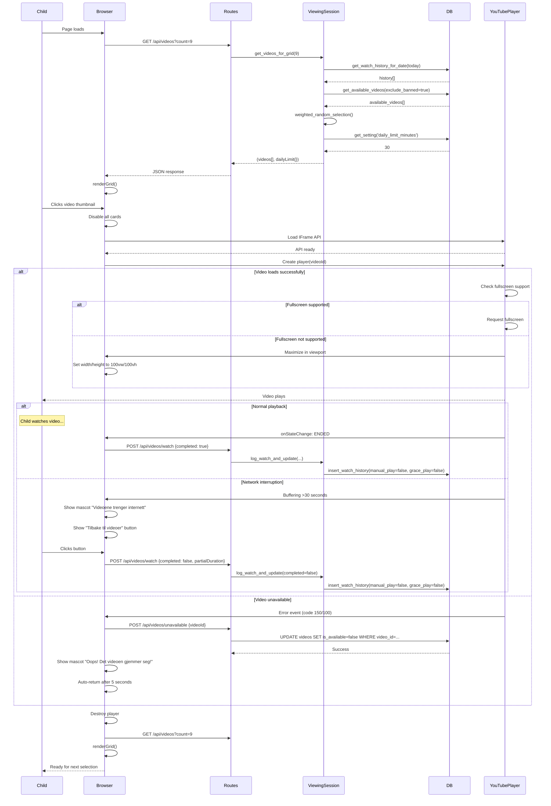
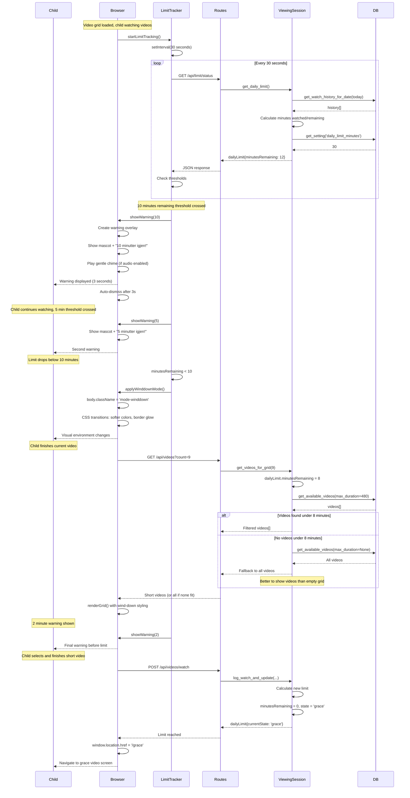
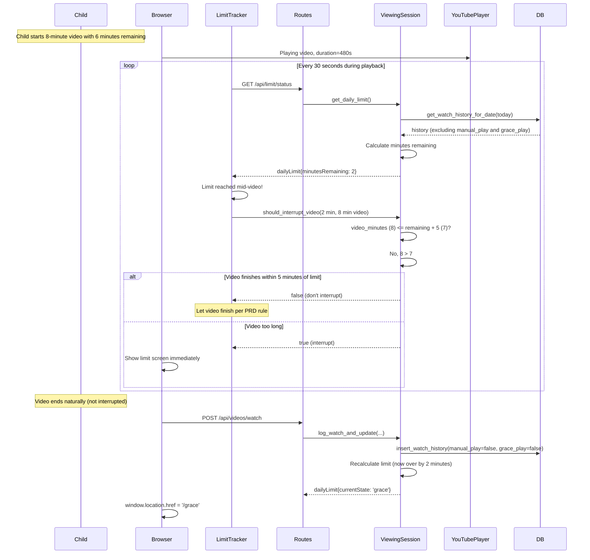
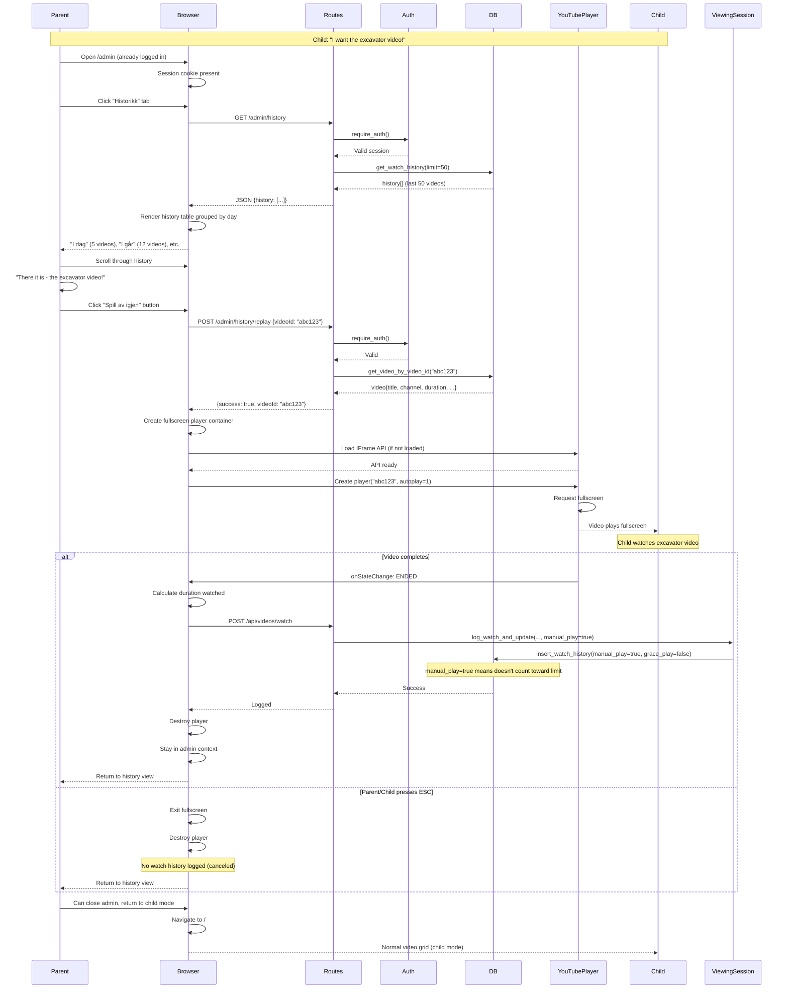

# Core Workflows

This section illustrates key system workflows using sequence diagrams. These diagrams show the interactions between components during critical user journeys, clarifying the architecture in action.

## Workflow 1: Child Watches Video with Error Handling

**User Goal:** Child selects and watches a video, then returns to grid for another selection



**Key Points:**
- All operations synchronous, run in thread pool
- Grid regenerates with new random selection after each video
- Watch history logged only on video completion (ESC cancels without logging)
- Daily limit recalculated after every watch
- Video unavailability marks ALL duplicate instances globally
- Network interruptions handled with mascot guidance
- Fullscreen fallback for unsupported browsers

## Workflow 2: Time Limit Progression with Warnings

**User Goal:** Child receives progressive warnings as daily limit approaches



**Key Points:**
- Polling every 30 seconds (not real-time, acceptable for single user)
- Three warnings: 10, 5, 2 minutes (hardcoded thresholds)
- Wind-down mode filters to videos that fit remaining time
- Empty grid fallback: shows all videos if none fit
- Visual mode changes via CSS classes
- Automatic navigation to grace screen when limit hits

## Workflow 3: Mid-Video Limit Reached

**User Goal:** Handle limit being reached while video is playing



**Key Rule:** If video will complete within 5 minutes after limit is reached, let it finish. Otherwise interrupt immediately.

## Workflow 4: Grace Video Selection and Goodbye

**User Goal:** Child offered one final video, then sees friendly goodbye message

```mermaid
sequenceDiagram
    participant Child
    participant Browser
    participant Routes
    participant ViewingSession
    participant DB
    participant YouTubePlayer

    Note over Child: Daily limit reached, navigated to /grace
    
    Browser->>Browser: Load grace.html template
    Browser->>Browser: Show mascot + "Vi er ferdige for i dag!"
    Browser->>Browser: Show "Vil du se én til?" question
    Browser-->>Child: Two buttons: "Ja, én til!" / "Nei, ha det!"
    
    alt Child clicks "Ja, én til!"
        Child->>Browser: Click "Ja" button
        Browser->>Routes: GET /api/videos?count=6
        Routes->>ViewingSession: get_videos_for_grid(6)
        ViewingSession->>ViewingSession: dailyLimit.state = 'grace'
        ViewingSession->>DB: get_available_videos(max_duration=300)
        DB-->>ViewingSession: videos[]
        
        alt Videos found under 5 minutes
            ViewingSession-->>Routes: 4-6 grace videos
        else No videos under 5 minutes
            ViewingSession->>DB: get_available_videos(max_duration=None)
            DB-->>ViewingSession: All videos
            ViewingSession->>ViewingSession: Filter to shortest 6 videos
            ViewingSession-->>Routes: Best effort grace videos
        end
        
        Routes-->>Browser: Grace grid videos
        Browser->>Browser: renderGraceGrid() with softer styling
        Browser-->>Child: Grid with 4-6 thumbnails
        
        Child->>Browser: Clicks grace video
        Browser->>YouTubePlayer: Create player, play video
        YouTubePlayer-->>Child: Grace video plays
        
        Note over Child: Video ends
        
        YouTubePlayer->>Browser: onStateChange: ENDED
        Browser->>Routes: POST /api/videos/watch
        Routes->>ViewingSession: log_watch_and_update(..., grace_play=true)
        ViewingSession->>DB: insert_watch_history(
            manual_play=false,
            grace_play=true
        )
        Note over DB: grace_play=true means doesn't count toward limits
        ViewingSession->>ViewingSession: Grace consumed, state='locked'
        ViewingSession-->>Routes: dailyLimit{currentState: 'locked'}
        Routes-->>Browser: Locked state
        
        Browser->>Browser: window.location.href = '/goodbye'
        
    else Child clicks "Nei, ha det!"
        Child->>Browser: Click "Nei" button
        Browser->>Browser: window.location.href = '/goodbye'
    end
    
    Note over Browser: Goodbye screen loads
    
    Browser->>Browser: Load goodbye.html
    Browser->>Browser: Show mascot waving goodbye
    Browser->>Browser: Show "Ha det! Vi ses i morgen!"
    Browser-->>Child: Static goodbye screen
    
    Note over Child: If child tries to access /api/videos
    
    Child->>Browser: Attempts to reload or navigate
    Browser->>Routes: GET /api/videos
    Routes->>ViewingSession: get_videos_for_grid()
    ViewingSession->>ViewingSession: dailyLimit.state = 'locked'
    ViewingSession-->>Routes: Empty videos[], locked state
    Routes-->>Browser: No videos available
    Browser->>Browser: Redirect to /goodbye or show locked message
    Browser-->>Child: Stays on goodbye screen
    
    Note over Child,DB: Midnight UTC arrives
    
    Browser->>Routes: GET /api/limit/status (next day)
    Routes->>ViewingSession: get_daily_limit()
    ViewingSession->>ViewingSession: today = new date
    ViewingSession->>DB: get_watch_history_for_date(today)
    DB-->>ViewingSession: Empty (new day)
    ViewingSession->>ViewingSession: Minutes watched = 0, state = 'normal'
    ViewingSession-->>Routes: dailyLimit{currentState: 'normal'}
    Routes-->>Browser: Unlocked
    Browser->>Browser: window.location.href = '/'
    Browser-->>Child: Normal grid available again
```

**Key Points:**
- Grace grid shows fewer videos (4-6) with stricter filter (≤5 min)
- Grace video logged with `grace_play=true` (doesn't count toward tomorrow's limit)
- After grace video or "Nei" button, app locks until midnight UTC
- State calculation based on current UTC date, resets automatically at midnight
- No countdown timer on goodbye screen (static, peaceful message)
- Empty grace grid fallback: show shortest available videos

## Workflow 5: Parent Adds Channel/Playlist

**User Goal:** Parent adds new YouTube channel/playlist as approved content source

```mermaid
sequenceDiagram
    participant Parent
    participant Browser
    participant Routes
    participant Auth
    participant ContentSource
    participant DB
    participant YouTubeAPI

    Parent->>Browser: Navigate to /admin
    Browser->>Routes: GET /admin (no session cookie)
    Routes->>Auth: Check authentication
    Auth-->>Routes: Not authenticated
    Routes-->>Browser: Redirect to /admin/login
    
    Browser->>Browser: Show login form
    Parent->>Browser: Enter password, click "Logg inn"
    Browser->>Routes: POST /admin/login {password}
    Routes->>Auth: verify_password(password)
    Auth->>DB: get_setting('admin_password_hash')
    DB-->>Auth: bcrypt_hash
    Auth->>Auth: bcrypt.verify(password, hash)
    Auth-->>Routes: True
    Routes->>Auth: create_session()
    Auth->>Auth: Generate session_id, store in memory
    Auth-->>Routes: session_id
    Routes->>Browser: Set-Cookie: session_id (HttpOnly, Secure)
    Routes-->>Browser: {redirect: '/admin/dashboard'}
    Browser->>Browser: Navigate to dashboard
    
    Parent->>Browser: Click "Kanaler" tab
    Browser->>Routes: GET /admin/sources
    Routes->>Auth: require_auth(session_id from cookie)
    Auth->>Auth: validate_session(session_id)
    Auth-->>Routes: Valid
    Routes->>ContentSource: list_sources()
    ContentSource->>DB: get_all_content_sources()
    DB-->>ContentSource: sources[]
    ContentSource-->>Routes: sources[]
    Routes-->>Browser: JSON {sources: [...]}
    Browser->>Browser: Render channel table
    
    Parent->>Browser: Paste channel URL, click "Legg til"
    Browser->>Routes: POST /admin/sources {input: "https://youtube.com/..."}
    Routes->>Auth: require_auth()
    Auth-->>Routes: Valid
    Routes->>ContentSource: add_source(input)
    
    Note over ContentSource: Runs in thread pool (blocking OK)
    
    ContentSource->>ContentSource: _parse_input(url)
    ContentSource->>ContentSource: Extract channel_id: "UCxyz..."
    ContentSource->>DB: get_source_by_source_id("UCxyz...")
    DB-->>ContentSource: None (doesn't exist)
    
    ContentSource->>YouTubeAPI: search().list(channelId="UCxyz...")
    Note over YouTubeAPI: Blocking HTTP call (page 1) with retry
    YouTubeAPI-->>ContentSource: {items: [...], nextPageToken: "token1"}
    ContentSource->>ContentSource: Extract video_ids[]
    
    ContentSource->>YouTubeAPI: videos().list(id="vid1,vid2,...")
    YouTubeAPI-->>ContentSource: Video details with durations
    
    ContentSource->>ContentSource: Store videos in memory
    
    loop Until no more pages (or error after retries)
        ContentSource->>YouTubeAPI: search().list(pageToken="tokenN")
        
        alt API success (within retry limit)
            YouTubeAPI-->>ContentSource: Next page of videos
            ContentSource->>YouTubeAPI: videos().list() for details
            YouTubeAPI-->>ContentSource: Details with durations
        else Network error after 3 retries
            Note over ContentSource: Return partial results (e.g., 600 of 800)
            ContentSource->>ContentSource: Set fetch_complete = False
        end
    end
    
    Note over ContentSource: Deduplication before save
    
    ContentSource->>ContentSource: _deduplicate_videos(videos)
    ContentSource->>DB: insert_content_source(...)
    DB-->>ContentSource: source{id: 3, ...}
    ContentSource->>DB: bulk_insert_videos(videos, source_id=3)
    Note over DB: Single transaction, 600 INSERTs
    DB-->>ContentSource: Success
    ContentSource->>DB: log_api_call('add_source', cost=100)
    DB-->>ContentSource: Logged
    
    alt Complete fetch
        ContentSource-->>Routes: (source{}, 600, True)
        Routes-->>Browser: {success: true, videosAdded: 600, message: "Kanal lagt til: X (600 videoer)"}
    else Partial fetch
        ContentSource-->>Routes: (source{}, 600, False)
        Routes-->>Browser: {success: true, partial: true, videosAdded: 600, 
                             message: "Lagt til 600 videoer (nettverksfeil). 
                             Klikk 'Oppdater' for å hente resten.",
                             retryAvailable: true}
    end
    
    Browser->>Browser: Show success/partial message
    Browser->>Routes: GET /admin/sources (refresh list)
    Routes->>ContentSource: list_sources()
    ContentSource->>DB: get_all_content_sources()
    DB-->>ContentSource: sources[] (including new one)
    ContentSource-->>Routes: sources[]
    Routes-->>Browser: Updated table data
    Browser->>Browser: Re-render table with new channel
    Browser-->>Parent: Channel added, videos available (with partial notice if applicable)
```

**Key Points:**
- YouTube API calls are blocking (acceptable, runs in thread pool)
- Page-level retry logic (3 attempts, 0s/1s/2s backoff)
- Pagination fetches ALL videos, no artificial limit
- Partial fetch returns what was fetched with flag
- Deduplication removes duplicate video IDs before save
- Single database transaction for bulk insert
- Session-based auth with cookies
- Parent sees loading message during fetch
- Clear partial fetch messaging with retry option

## Workflow 6: Parent Uses "Play Again" for Specific Video

**User Goal:** Parent manually plays specific video child requested, bypassing time limit



**Key Points:**
- Manual playback sets `manual_play=true` flag in watch history
- Manual plays do NOT count toward daily time limit (excluded from calculation)
- Returns to admin context after video (not child grid)
- Parent can play multiple videos in sequence if needed
- ESC at any time cancels without logging
- Clear separation between manual (parent) and automatic (child) playback

---

