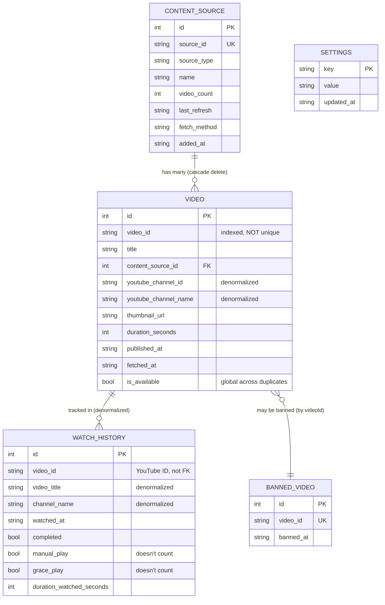

# Data Models

Define the core data models/entities that will be shared between frontend and backend. These models represent the business domain and drive both database schema and API contracts.

## Design Decision: Simplified Source-Video Relationship

Videos belong to exactly one content source. Duplicate videos across sources are stored as separate rows. When a content source is removed, all its videos are cascade deleted. This trades some storage efficiency for massive simplification.

## Model: ContentSource

**Purpose:** Represents a parent-approved YouTube channel or playlist as a content source.

```javascript
/**
 * @typedef {Object} ContentSource
 * @property {number} id - Primary key, auto-increment
 * @property {string} sourceId - YouTube channel ID or playlist ID (unique)
 * @property {'channel'|'playlist'} sourceType - Type of content source
 * @property {string} name - Channel or playlist name for display
 * @property {number} videoCount - Number of videos currently cached from this source
 * @property {string} lastRefresh - ISO 8601 timestamp of last video fetch
 * @property {'api'} fetchMethod - Which method successfully fetched videos
 * @property {string} addedAt - ISO 8601 timestamp when parent added source
 */
```

**Relationships:**
- Has many Videos (one-to-many, cascade delete)

## Model: Video

**Purpose:** Represents a YouTube video available for child viewing from a parent-approved source.

```javascript
/**
 * @typedef {Object} Video
 * @property {number} id - Primary key, auto-increment
 * @property {string} videoId - YouTube video ID (11 characters, indexed but NOT unique - allows duplicates across sources)
 * @property {string} title - Video title in original language, not translated
 * @property {number} contentSourceId - FK to content_sources.id (CASCADE DELETE)
 * @property {string} youtubeChannelId - Denormalized YouTube channel ID (NOT a FK to our tables)
 * @property {string} youtubeChannelName - Denormalized YouTube channel name (NOT a FK to our tables)
 * @property {string} thumbnailUrl - YouTube thumbnail URL (default quality)
 * @property {number} durationSeconds - Video duration for wind-down filtering
 * @property {string} publishedAt - ISO 8601 timestamp when video was published on YouTube
 * @property {string} fetchedAt - ISO 8601 timestamp when we fetched this metadata
 * @property {boolean} isAvailable - False if video becomes private/deleted/region-locked (global across all duplicate instances)
 */
```

**Relationships:**
- Belongs to one ContentSource (many-to-one, cascade delete)
- Has many WatchHistory entries (one-to-many)
- May be referenced by BannedVideo (one-to-one optional)

**Note on duplicates:** The same YouTube video appearing in multiple sources (e.g., "Blippi" channel and "Best of Blippi" playlist) will have multiple rows. This is intentional - simplifies source removal at the cost of some storage. When marked unavailable, ALL duplicate instances are marked (global availability).

## Model: WatchHistory

**Purpose:** Tracks which videos were watched, when, and how (auto-play vs manual replay vs grace).

```javascript
/**
 * @typedef {Object} WatchHistoryEntry
 * @property {number} id - Primary key, auto-increment
 * @property {string} videoId - YouTube video ID (NOT a FK, just the ID string for flexibility)
 * @property {string} videoTitle - Denormalized video title for history display
 * @property {string} channelName - Denormalized channel name for history display
 * @property {string} watchedAt - ISO 8601 timestamp when video started playing
 * @property {boolean} completed - True if video played to end, false if ESC pressed
 * @property {boolean} manualPlay - True if played via admin "Play Again", false if child selection (doesn't count toward limit)
 * @property {boolean} gracePlay - True if child's grace video (doesn't count toward limit)
 * @property {number} durationWatchedSeconds - Actual watch time for time limit accounting
 */
```

**Design note:** We denormalize video title and channel name so watch history remains intact even if the video is removed from our database or the content source is deleted. Parent can still see what was watched.

**Limit calculation:** Only entries where `manual_play=false AND grace_play=false` count toward daily limit.

## Model: BannedVideo

**Purpose:** Videos that parent has explicitly blocked from appearing in child's grid.

```javascript
/**
 * @typedef {Object} BannedVideo
 * @property {number} id - Primary key, auto-increment
 * @property {string} videoId - YouTube video ID (unique)
 * @property {string} bannedAt - ISO 8601 timestamp when banned
 */
```

**Note:** When a video is banned, it's filtered out of selection regardless of which content source(s) contain it. If the same video appears from multiple sources (duplicate rows), all instances are filtered.

## Model: Settings

**Purpose:** Key-value store for application configuration.

```javascript
/**
 * @typedef {Object} Setting
 * @property {string} key - Setting name (primary key)
 * @property {string} value - Setting value as JSON string
 * @property {string} updatedAt - ISO 8601 timestamp of last change
 */
```

**Common Settings:**
- `daily_limit_minutes`: Default 30, configurable by parent
- `grid_size`: Default 9 (range 4-15), configurable by parent
- `audio_enabled`: Default true, controls warning sounds
- `admin_password_hash`: bcrypt hash of admin password

**Hardcoded UX patterns (NOT in settings):**
- Warning thresholds: 10, 5, 2 minutes (fixed)
- Wind-down start: 10 minutes remaining (fixed)
- Grace video max duration: 5 minutes (fixed)

## Model: DailyLimit (Computed State)

**Purpose:** Runtime state object tracking current day's viewing. Not a database table, computed from watch history.

```javascript
/**
 * @typedef {Object} DailyLimit
 * @property {string} date - Current date in YYYY-MM-DD format (UTC)
 * @property {number} minutesWatched - Total minutes watched today
 * @property {number} minutesRemaining - Calculated from daily_limit_minutes setting
 * @property {'normal'|'winddown'|'grace'|'locked'} currentState - Current session state
 * @property {string} resetTime - ISO 8601 timestamp of midnight UTC (next reset)
 */
```

**Computed from:**
- Sum of `watch_history.duration_watched_seconds WHERE DATE(watched_at) = current UTC date AND manual_play = 0 AND grace_play = 0`
- Settings value `daily_limit_minutes`

**State transitions:**
- `normal`: More than 10 minutes remaining
- `winddown`: 10 minutes or less remaining (visual changes, filtered videos)
- `grace`: Limit reached, offered one more video under 5 minutes
- `locked`: Grace video completed or declined, locked until midnight UTC

## Data Model Relationships



---

