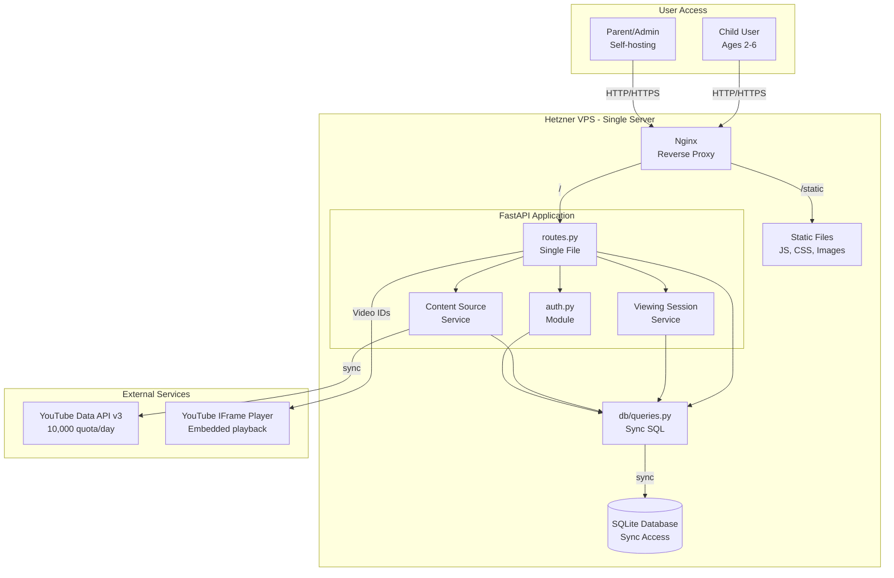

# High Level Architecture

## Technical Summary

Safe YouTube Viewer for Kids is a **monolithic web application** deployed as a single Python FastAPI service with server-side rendered templates and vanilla JavaScript enhancements. The architecture prioritizes **simplicity and safety** over scalability - designed for a single-family deployment with minimal operational overhead. The backend handles YouTube API integration, video metadata caching, watch history tracking, and daily limit enforcement, while the frontend provides a visual-first child interface requiring zero reading ability and a password-protected Norwegian admin panel. All content is pre-approved by parents through channel/playlist management, with no discovery mechanisms exposed to children. The system operates entirely self-contained on a Hetzner VPS with **synchronous SQLite** persistence, making it maintainable by a single self-hosting parent without containers or complex infrastructure.

## Platform and Infrastructure Choice

**Platform:** Self-Hosted Hetzner VPS (Cloud Server)

**Rationale:** 
- **Complete Control:** Parent controls all data, no third-party services with child viewing data
- **Cost Effective:** €4-8/month vs. platform services at €20-50/month
- **Simple Operations:** Direct systemd service, no orchestration complexity
- **Privacy First:** All data remains in family's control, critical for child safety application
- **No Vendor Lock-in:** Standard Linux server, portable to any VPS provider

**Key Services:**
- **Web Server:** Nginx (reverse proxy, static file serving, SSL termination)
- **Application Server:** FastAPI with Uvicorn (Python ASGI server)
- **Database:** SQLite (file-based, synchronous access, zero administration)
- **Process Management:** systemd (service supervision, auto-restart)
- **SSL/TLS:** Let's Encrypt via Certbot (free SSL certificates)
- **YouTube Integration:** YouTube Data API v3 (video metadata)
- **Backup:** Automated daily local backups via systemd timer

**Deployment Host and Regions:**
- **Primary Location:** Hetzner Falkenstein, Germany (closest to Norway, GDPR compliant)
- **Server Specs:** CX11 (1 vCPU, 2GB RAM, 20GB SSD) - sufficient for single family
- **Bandwidth:** 20TB/month included - more than adequate for metadata API calls

## Repository Structure

**Structure:** Monorepo with simple directory organization

**Rationale:**
- Single application with tightly coupled frontend/backend
- No need for independent deployment of components
- Simplified dependency management with single `pyproject.toml`
- All code in one place for easy understanding

**Repository Organization:**
```
safe-youtube-viewer/
├── backend/           # Python FastAPI application
├── frontend/          # HTML templates, vanilla JS, CSS
├── static/            # Images, fonts, sounds
├── docs/              # Architecture, PRD, frontend spec
├── tests/             # Test files
└── scripts/           # Deployment and maintenance scripts
```

## High Level Architecture Diagram



## Architectural Patterns

**1. Monolithic Layered Architecture:** All functionality in single application with clear layer separation (routes → services → database) - **Rationale:** Single deployment unit, minimal operational complexity, appropriate for single-family scale

**2. Server-Side Rendering (SSR) with Progressive Enhancement:** Jinja2 templates render complete HTML, vanilla JavaScript enhances interactivity - **Rationale:** Works without JavaScript, faster initial load, simpler than SPA for this use case

**3. Synchronous Operations:** All operations synchronous, run in FastAPI's thread pool - **Rationale:** Single-user deployment has no concurrency needs, async overhead buys nothing

**4. Direct Database Access:** Services call database functions directly without repository abstraction - **Rationale:** SQLite queries are simple, abstraction adds overhead without benefit at this scale

**5. Weighted Random Selection Algorithm:** Probability-based video selection with engagement tracking - **Rationale:** Balances novelty (60-80%) with familiar favorites (20-40%) as specified in PRD

**6. State Machine Pattern:** Time limit progression through distinct states (Normal → Warning → Wind-down → Grace → Locked) - **Rationale:** Clear transitions, predictable behavior, matches UX specification exactly

**7. Cache-Aside Pattern:** Video metadata cached in SQLite, API called only for refresh - **Rationale:** Minimizes API quota usage, faster grid generation, works offline once populated

**8. Simplified Error Handling:** Operations fail with clear messages, parent retries - **Rationale:** No fallback complexity needed for single-family deployment

---

