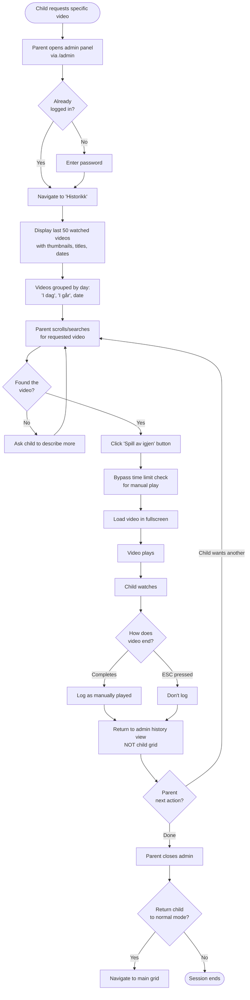

# Safe YouTube Viewer for Kids - UI/UX Specification

**Version:** 1.0  
**Date:** 2025-01-03  
**Project:** Safe YouTube Viewer for Kids  
**Document Owner:** UX Expert (Sally)

---

## Table of Contents

1. [Introduction](#introduction)
2. [Overall UX Goals & Principles](#overall-ux-goals--principles)
3. [Information Architecture](#information-architecture)
4. [User Flows](#user-flows)
5. [Wireframes & Mockups](#wireframes--mockups)
6. [Component Library / Design System](#component-library--design-system)
7. [Branding & Style Guide](#branding--style-guide)
8. [Accessibility Requirements](#accessibility-requirements)
9. [Responsiveness Strategy](#responsiveness-strategy)
10. [Animation & Micro-interactions](#animation--micro-interactions)
11. [Performance Considerations](#performance-considerations)
12. [Next Steps](#next-steps)

---

## Introduction

This document defines the user experience goals, information architecture, user flows, and visual design specifications for Safe YouTube Viewer for Kids's user interface. It serves as the foundation for visual design and frontend development, ensuring a cohesive and user-centered experience.

The Safe YouTube Viewer for Kids is a web application designed for children ages 2-6 to safely watch YouTube videos from parent-approved channels and playlists. The application eliminates inappropriate content exposure through complete parental control while enabling independent video selection through a visual, child-friendly interface requiring no reading ability.

### Key Design Challenges

- **Pre-reader interface:** Children ages 2-6 cannot read, requiring purely visual navigation
- **Safety first:** 100% of content must be parent-approved with zero discovery mechanisms
- **Healthy boundaries:** Daily viewing limits with gentle, non-punitive enforcement
- **Independent use:** Child can operate without constant parental supervision
- **Dual user base:** Both young children (primary) and parents (admin) must find interface appropriate

---

## Overall UX Goals & Principles

### Target User Personas

**Primary User - The Independent Viewer (Ages 2-6):**
A pre-reading child who wants to watch videos independently. Cannot read text, relies entirely on visual recognition. Needs large, clear choices with immediate feedback. May have limited fine motor control (especially 2-3 year olds). Thrives on routine and predictability.

**Secondary User - The Parent/Guardian:**
A parent who wants complete control over content while minimizing daily intervention. Technically comfortable but time-constrained. Prioritizes child safety over feature richness. Needs confidence the system works as promised. Self-hosting on own server, comfortable with environment variable configuration.

### Usability Goals

- **Zero-reading requirement:** Every child interaction must work through visuals alone (thumbnails, colors, icons, gender-neutral mascot)
- **One-click success:** Children should never need more than one action to accomplish their goal (select video, return home)
- **Immediate feedback:** Every click/tap produces instant visual or audio confirmation within 200ms
- **Frustration-free limits:** Time boundaries approached gradually with multiple warnings (10, 5, 2 minutes) and pronounced visual changes to condition expectations
- **Parent efficiency:** Setup takes under 10 minutes; daily involvement is zero except for manual replay requests
- **Graceful degradation:** System never shows empty grids or leaves child on error screens - always provides path forward
- **Touch-optimized:** Larger targets on tablets (220x165px) vs desktop (200x150px) for precise interaction

### Design Principles

1. **Visual Recognition Over Reading** - Thumbnails are the interface. Text is decoration for adults. Norwegian UI for parents only.

2. **Predictable Patterns** - The same screen always appears after videos. No surprises. Grid regenerates on parent changes to reflect current content.

3. **Gentle Boundaries** - Multiple warnings (10, 5, 2 min) with increasingly pronounced visual changes condition children. Current video finishes if <5 minutes remaining when limit hits. Wind-down mode prevents mid-video interruptions.

4. **Playful Confidence** - Bright colors and friendly gender-neutral mascot make children feel capable and safe. Mascot guides through errors ("Oops, that video is hiding!") with auto-recovery.

5. **Invisible Complexity** - All technical and administrative features hidden behind parent gateway. Multiple children supported via separate instances (MVP simplification).

6. **Never Zero Probability** - Every video always has some chance of appearing. System never shows empty grids even if all recently watched.

7. **Parent Control with Context** - History view with "Play Again" for specific requests. Quick "ban video" button for unexpected upsetting content. Review capability for time management decisions.

### Edge Case Handling Principles

**Error Recovery:**
- Failed videos show mascot message, auto-return to grid after 5 seconds
- Connection drops after 30s buffering: mascot explains, option to return (time not counted)
- Dead videos detected and removed during weekly refresh
- Never leave child stranded on error state

**Time Management:**
- UTC tracking with local display prevents timezone issues
- Graceful reset if clock anomalies detected (negative time, >24hr)
- Parent reviews history to understand actual viewing patterns
- System logs anomalies for parent review

**Content Control:**
- Parent "ban" button in history prevents specific videos from reappearing
- Grid regenerates immediately when parent adds/removes channels
- Probability weighting ensures variety while never completely hiding videos

**Technical Foundation:**
- Password reset via environment variable (self-hosted model)
- Touch targets adapt to device (larger on tablets)
- No hover-dependent interactions (touch compatibility)

---

## Information Architecture

### Site Map / Screen Inventory

```mermaid
graph TD
    A[Video Grid - Home] -->|Click thumbnail| B[Video Playback - Fullscreen]
    B -->|Video ends| A
    B -->|ESC key| A
    B -->|Connection lost| C[Connection Error]
    C -->|Auto 5sec| A
    B -->|Video unavailable| D[Video Error]
    D -->|Auto 5sec| A
    
    A -->|10 min warning| E[Warning Overlay - 10 min]
    E --> A
    A -->|5 min warning| F[Warning Overlay - 5 min]
    F --> A
    A -->|2 min warning| G[Warning Overlay - 2 min]
    G --> A
    
    A -->|<10 min remaining| H[Wind-down Grid - Visual indicator + short videos]
    H -->|Click thumbnail| B
    
    A -->|Limit reached| I[Limit Reached - One more option]
    I -->|Select one more| J[Grace Video Grid - <5 min only]
    J -->|Click thumbnail| K[Grace Video Playback]
    K -->|Video ends| L[Goodbye Screen]
    L -->|Tomorrow| M[Locked Until Reset]
    
    I -->|No thanks| L
    
    N[/admin/login] -->|Password| O[Admin Dashboard]
    O --> P[Channel Management]
    O --> Q[Settings]
    O --> R[Watch History]
    
    P -->|Add channel/playlist| P
    P -->|Remove source| P
    P -->|Refresh videos| P
    
    R -->|Play Again button| B
    R -->|Ban video button| S[Video Banned Confirmation]
    S --> R
    
    Q -->|Configure| Q
```

### Navigation Structure

**Child Navigation (Zero-Control Model):**
- **No navigation controls** - Children never choose "where" to go, only "what" to watch
- **Automatic returns** - Every path leads back to video grid after completion
- **Single action** - One click/tap from grid to video, automatic return
- **Error recovery** - All error states auto-return to grid (5 second timeout with mascot message)
- **State transitions** - System moves child through warning → wind-down → grace → goodbye automatically based on time

**Visual State Indicators:**
- **Normal mode:** Standard bright yellow accents, full color saturation
- **Wind-down mode (<10 min):** Distinct visual treatment - softer colors, border glow, signals transition period
- **Grace mode:** Further visual distinction showing "last video" state

**Parent Navigation (Admin Area):**
- **Primary Navigation:** Horizontal tabs or sidebar with Dashboard, Channels, History, Settings
- **Persistent logout button** - Always accessible in header
- **Breadcrumb Strategy:** Not needed - flat structure, only 2 levels deep maximum
- **Entry point:** `/admin` requires password, redirects to dashboard
- **Context preservation:** Admin stays in admin area until explicit logout

**Cross-Context Navigation:**
- **"Play Again" bridge:** History view's play button sends parent to child's video playback, returns to history after video ends (not to child grid)
- **No child-to-parent path:** Children cannot access admin area without password
- **Emergency parent access:** Parents can ESC from any child screen to return to admin (requires password re-entry)

---

## User Flows

### Flow 1: Child Watches Video (Happy Path)

**User Goal:** Select and watch a video independently

**Entry Points:** 
- App opens to video grid (default)
- Returning from previous video
- Parent manually loads app for child

**Success Criteria:** 
- Child successfully selects video based on thumbnail recognition
- Video plays without interruption
- Child returns to grid to select another video

**Flow Diagram:**

```mermaid
graph TD
    Start([Child sees video grid]) --> Browse{Child browses<br/>9 thumbnails}
    Browse --> Recognize[Child recognizes<br/>interesting thumbnail]
    Recognize --> Click[Click/tap thumbnail]
    
    Click --> Loading[Loading indicator<br/>appears <200ms]
    Loading --> APICall[Fetch video from YouTube]
    
    APICall --> CheckVideo{Video<br/>available?}
    
    CheckVideo -->|Yes| Fullscreen[Video plays fullscreen<br/>automatically]
    CheckVideo -->|No| Error[Mascot: "Oops! That video<br/>is hiding!"]
    Error --> Wait[Wait 5 seconds]
    Wait --> Browse
    
    Fullscreen --> Watching[Child watches video]
    Watching --> CheckConnection{Connection<br/>OK?}
    
    CheckConnection -->|Yes| VideoEnd{Video<br/>ends?}
    CheckConnection -->|No, >30s buffer| ConnError[Mascot: "Videos need<br/>internet"]
    ConnError --> ReturnOption[Option to return<br/>to grid]
    ReturnOption --> Browse
    
    VideoEnd -->|Complete| LogWatch[Log to history<br/>Count toward time limit]
    VideoEnd -->|ESC pressed| NoLog[Don't count as watched]
    
    LogWatch --> CheckLimit{Time limit<br/>reached?}
    NoLog --> CheckLimit
    
    CheckLimit -->|No| Browse
    CheckLimit -->|Yes| LimitFlow[Go to Limit Flow]
```

**Edge Cases & Error Handling:**
- **Rapid clicking:** Grid disables after first click until video loads or error occurs
- **Video unavailable:** Mascot appears with friendly message, auto-returns after 5 seconds
- **ESC during loading:** Cancels load, returns to grid, doesn't count as watched
- **Connection drop:** After 30s buffering, mascot explains, offers return (no time counted)
- **Child walks away:** Video plays to completion, counts toward limit (parent reviews history)

### Flow 2: Time Limit Progression with Warnings

**User Goal:** Understand approaching time limit and wind down gracefully

**Entry Points:** 
- 10 minutes remaining in daily limit
- Continuing from previous video in same session

**Success Criteria:**
- Child receives multiple warnings (10, 5, 2 min) to prepare
- Visual environment changes to condition response
- Wind-down mode filters to appropriate video lengths
- Child reaches limit without surprise or frustration

**Flow Diagram:**

```mermaid
graph TD
    Start([During video playback]) --> Check10{10 minutes<br/>remaining?}
    
    Check10 -->|Yes| Warn10[Warning overlay:<br/>Mascot + "10 minutter igjen!"]
    Check10 -->|No| Continue[Continue playback]
    
    Warn10 --> PlaySound10[Gentle chime sound]
    PlaySound10 --> AutoDismiss10[Auto-dismiss after 3s]
    AutoDismiss10 --> Continue
    
    Continue --> VideoEnd1[Video ends,<br/>return to grid]
    VideoEnd1 --> Check5{5 minutes<br/>remaining?}
    
    Check5 -->|Yes| Warn5[Warning overlay:<br/>Mascot + "5 minutter igjen!"]
    Check5 -->|No| NormalGrid[Show normal grid]
    
    Warn5 --> PlaySound5[Gentle chime sound]
    PlaySound5 --> AutoDismiss5[Auto-dismiss after 3s]
    AutoDismiss5 --> NormalGrid
    
    NormalGrid --> Select1[Child selects video]
    Select1 --> VideoEnd2[Video ends,<br/>return to grid]
    VideoEnd2 --> Check2{2 minutes<br/>remaining?}
    
    Check2 -->|Yes| Warn2[Warning overlay:<br/>Mascot + "2 minutter igjen!"]
    Check2 -->|No| CheckWindown{<10 minutes<br/>remaining?}
    
    Warn2 --> PlaySound2[Gentle chime sound]
    PlaySound2 --> AutoDismiss2[Auto-dismiss after 3s]
    AutoDismiss2 --> CheckWindown
    
    CheckWindown -->|Yes| Winddown[Wind-down mode:<br/>Visual change + filter]
    CheckWindown -->|No| NormalGrid
    
    Winddown --> FilterVideos[Show only videos<br/>that fit in remaining time]
    FilterVideos --> VisualChange[Softer colors,<br/>border glow effect]
    VisualChange --> Select2[Child selects<br/>short video]
    
    Select2 --> PlayShort[Play video]
    PlayShort --> CheckDuring{During video:<br/>limit reached?}
    
    CheckDuring -->|<5 min left in video| AllowFinish[Let current video finish]
    CheckDuring -->|>5 min left| ShowLimit[Time limit screen]
    
    AllowFinish --> VideoComplete[Video completes]
    VideoComplete --> ShowLimit
    
    ShowLimit --> GraceFlow[Go to Grace Video Flow]
```

**Edge Cases & Error Handling:**
- **Multiple warnings in one video:** If watching long video (15+ min), child might see multiple warnings during same video - reinforces message
- **Wind-down entered mid-video:** If child starts 8-minute video with 9 minutes remaining, allow completion per rule
- **No short videos available:** Should never happen (probability never zero)
- **Child ignores warnings:** Visual changes and filtering still guide toward appropriate videos
- **Warning dismissed too quickly:** 3-second auto-dismiss ensures message displays

### Flow 3: Grace Video Selection and Goodbye

**User Goal:** Choose one final video when daily limit reached

**Entry Points:**
- Time limit reached after video completion
- Time limit reached mid-video (allowed to finish if <5 min remaining)

**Success Criteria:**
- Child offered "one more video" choice
- Only videos <5 minutes shown
- After grace video, friendly goodbye displayed
- App locks until next day

**Flow Diagram:**

```mermaid
graph TD
    Start([Time limit reached]) --> LimitScreen[Limit Reached Screen:<br/>Mascot appears]
    
    LimitScreen --> MascotMessage["Mascot: 'Vi er ferdige for i dag!<br/>Vil du se én til?'"]
    
    MascotMessage --> Choice{Child choice}
    
    Choice -->|Clicks "Yes" button| GraceGrid[Grace Video Grid appears]
    Choice -->|Clicks "No" / waits| Goodbye[Goodbye Screen]
    
    GraceGrid --> FilterShort[Show only videos<br/><5 minutes duration]
    FilterShort --> ShowFewer[Display 4-6 thumbnails<br/>instead of 9]
    ShowFewer --> VisualCue[Distinct visual:<br/>even softer colors]
    
    VisualCue --> ChildSelect[Child selects video<br/>when ready]
    
    ChildSelect --> PlayGrace[Play grace video<br/>in fullscreen]
    
    PlayGrace --> GraceWatch[Child watches]
    GraceWatch --> GraceEnd[Video ends]
    
    GraceEnd --> LogFinal[Log as watched]
    LogFinal --> Goodbye
    
    Goodbye --> MascotBye["Mascot animation:<br/>'Ha det! Vi ses i morgen!'"]
    MascotBye --> StaticMessage[Simple friendly goodbye<br/>NO countdown timer]
    StaticMessage --> Locked[App locked until midnight]
    
    Locked --> Midnight{Is it<br/>tomorrow?}
    Midnight -->|No| ShowLocked[Display same locked screen<br/>if accessed]
    Midnight -->|Yes| Reset[Reset time limit<br/>at midnight UTC]
    
    ShowLocked --> Midnight
    Reset --> UnlockedGrid[Return to normal<br/>video grid]
```

**Edge Cases:**
- **Child clicks "no" by accident:** No recovery - teaches consequence of choice
- **Grace video unavailable:** Show error mascot, auto-return to grace grid for another selection
- **Child tries to select another after grace:** Grid doesn't appear, stays on goodbye screen
- **Parent wants to override limit:** Must access admin panel, enter password, reset limit manually
- **App accessed while locked:** Show locked screen with mascot saying "Vi ses i morgen!"
- **Grace video runs over time:** Acceptable - limit was already reached, grace is a courtesy
- **Grace video selection takes long time:** Acceptable - no pressure on child to hurry final choice

### Flow 4: Parent Adds Channel/Playlist

**User Goal:** Add new YouTube channel or playlist as approved content source

**Entry Points:**
- Parent logged into admin dashboard
- Navigates to "Channels" section

**Success Criteria:**
- Parent successfully adds channel via URL, ID, or name
- System fetches all available videos from source
- Videos appear in child's grid on next session
- Parent sees confirmation with video count

**Flow Diagram:**

```mermaid
graph TD
    Start([Parent in admin panel]) --> NavChannels[Navigate to<br/>'Kanaler' section]
    
    NavChannels --> ShowList[Display current channels<br/>with video counts]
    ShowList --> AddButton[Click 'Legg til kanal/spilleliste']
    
    AddButton --> InputForm[Input form appears]
    InputForm --> EnterURL[Parent enters URL,<br/>ID, or name]
    
    EnterURL --> Submit[Click 'Legg til']
    Submit --> Validate{Valid format?}
    
    Validate -->|No| ErrorMsg[Show error:<br/>'Ugyldig format']
    ErrorMsg --> InputForm
    
    Validate -->|Yes| ParseInput[Parse input to extract<br/>channel/playlist ID]
    ParseInput --> DetectType{Channel or<br/>playlist?}
    
    DetectType -->|Channel| APIChannel[YouTube API:<br/>Fetch channel videos]
    DetectType -->|Playlist| APIPlaylist[YouTube API:<br/>Fetch playlist videos]
    
    APIChannel --> CheckAPI{API<br/>available?}
    APIPlaylist --> CheckAPI
    
    CheckAPI -->|No| RSSFallback[Offer RSS fallback:<br/>'API ikke tilgjengelig.<br/>Bruk RSS (15 videoer)?']
    CheckAPI -->|Yes| FetchVideos[Fetch all videos<br/>with metadata]
    
    RSSFallback --> UserChoice{Parent<br/>accepts RSS?}
    UserChoice -->|No| InputForm
    UserChoice -->|Yes| FetchRSS[Fetch 15 recent via RSS]
    
    FetchVideos --> ShowProgress[Show progress:<br/>'Henter videoer...']
    FetchRSS --> ShowProgress
    
    ShowProgress --> ProcessVideos[Extract: title, thumbnail,<br/>duration, ID, publish date]
    ProcessVideos --> SaveDB[Save to SQLite database]
    
    SaveDB --> Success[Show success message:<br/>'Lagt til: X videoer']
    Success --> RefreshList[Refresh channel list<br/>with new source]
    
    RefreshList --> LogTime[Log last refresh time]
    LogTime --> UpdateGrid[Child's grid will include<br/>new videos on next load]
    
    UpdateGrid --> End([Parent continues<br/>or closes admin])
```

**Edge Cases:**
- **Invalid URL format:** Show clear error with examples
- **Channel doesn't exist:** API returns 404, show "Kanal ikke funnet"
- **Private/restricted channel:** API returns error, explain cannot access
- **API quota exceeded:** Automatic fallback to RSS with explanation
- **Duplicate channel:** Check before adding, show "Denne kanalen er allerede lagt til"
- **No videos in channel:** Add channel but show warning
- **Very large channel (500+ videos):** Fetch up to 500, show message
- **Slow API response:** Show loading spinner, timeout after 30 seconds
- **Network failure mid-fetch:** Save partial results, allow retry

### Flow 5: Parent Uses "Play Again" for Specific Video

**User Goal:** Manually play a specific video child has requested

**Entry Points:**
- Parent in admin panel
- Child asks for specific video ("I want the excavator video!")
- Parent knows approximate video from recent history

**Success Criteria:**
- Parent finds video in history
- Can play it directly regardless of time limit
- Returns to admin history after video ends

**Flow Diagram:**



**Edge Cases:**
- **Video no longer available:** Show same error as child sees, offer to remove from history
- **Multiple similar videos:** Show thumbnails to help parent identify
- **Child can't articulate which video:** Parent can show child the history list
- **History is empty:** Show message "Ingen videoer sett ennå"
- **Parent accidentally bans instead of playing:** Confirmation dialog before banning
- **Time limit already reached:** Manual play still works (parent override)

---

## Wireframes & Mockups

### Design Files Approach

**Primary Design Files:** Design-in-code approach using this specification document as source of truth

### Key Screen Layouts

#### Screen 1: Video Grid - Normal Mode

**Purpose:** Primary child interface for video selection during normal viewing time

**Key Elements:**
- **Grid Container:** 3x3 layout (9 video thumbnails)
- **Video Thumbnails:** 
  - Desktop: 200x150px minimum, up to 280x210px for larger screens
  - Tablet: 220x165px (larger touch targets)
  - High-quality images from YouTube thumbnail URLs
  - Subtle border/shadow for depth
- **Video Titles:** Below each thumbnail, 2 lines max, truncate with ellipsis
  - Font size: 16-18px
  - Color: Dark gray/black for readability
  - Preserve original language
- **Background:** Bright, playful solid color or subtle pattern
  - Yellow (#FFDB4D) as primary accent
  - Rainbow palette for supporting colors
  - High energy, welcoming feel
- **No Navigation:** Zero UI chrome, no buttons, no menus
- **Loading State:** Brief spinner or mascot animation while thumbnails load

**Interaction Notes:**
- Click/tap anywhere on thumbnail card (entire card is clickable)
- Hover state on desktop: slight scale up (1.05x), shadow increase
- Active state: immediate visual feedback (<200ms)
- After click: entire grid fades out, loading indicator appears
- Debounce: grid disables after first click

**Responsive Behavior:**
- Desktop (1920x1080): 3x3 grid with generous spacing (20-30px gaps)
- Tablet landscape (1024x768): 3x3 grid with moderate spacing (15px gaps)
- Tablet portrait: 2x3 grid (6 videos) for better touch targets

#### Screen 2: Video Grid - Wind-Down Mode

**Purpose:** Signal approaching time limit through visual changes while showing only short videos

**Key Elements:**
- Same structure as Normal Mode grid, with distinct visual treatment:
- **Color Temperature Shift:** Warmer, softer tones
  - Background shifts from bright yellow to softer peach/coral
  - Or: reduce saturation by 20-30%
- **Border Treatment:** Animated subtle glow or pulsing border around entire viewport
  - Color: Soft orange or warm pink (#FF6B6B)
  - Animation: Gentle pulse, 3-4 second cycle
- **Optional Subtle Icon:** Small clock or hourglass icon in corner
- **Content Filter:** Only shows videos under remaining time
- **Same Interaction Pattern:** All click behaviors identical to normal mode

**Interaction Notes:**
- Transition from normal to wind-down is gradual (2-3 second fade)
- No sudden jarring change
- Child should subconsciously notice "something feels different"
- Still feels playful, not punitive

#### Screen 3: Video Playback - Fullscreen

**Purpose:** Immersive video watching experience with minimal distractions

**Key Elements:**
- **YouTube IFrame Player:** Embedded using YouTube IFrame API
  - Fullscreen mode activated automatically
  - Controls: YouTube's default controls visible on hover/tap
  - No related videos or end screens shown
- **Channel Attribution:** Small overlay in corner during first 5 seconds
  - Channel name in readable font
  - Fades out after 5 seconds
- **Keyboard Controls:**
  - Spacebar: Pause/play
  - ESC: Exit fullscreen, return to grid
  - Arrow keys: YouTube default (seek forward/back)
- **No Additional UI:** Clean, distraction-free viewing

**Interaction Notes:**
- Auto-play starts immediately upon load
- Fullscreen enters automatically
- On video end: 1-second black screen, then automatic return to grid
- On ESC: immediate return to grid, smooth fade transition

#### Screen 4: Warning Overlay (10, 5, 2 minutes)

**Purpose:** Gentle notification of remaining time to prepare child for transition

**Key Elements:**
- **Semi-transparent Overlay:** Appears over video grid
  - Background: Semi-transparent dark overlay (rgba(0,0,0,0.3))
  - Prevents interaction with grid behind
- **Mascot Character:** Centered, animated appearance
  - Friendly wave or bounce animation
  - Gender-neutral design
  - Large enough to be focal point (200-300px)
- **Warning Text:** Large, clear Norwegian message
  - "10 minutter igjen!" / "5 minutter igjen!" / "2 minutter igjen!"
  - Font size: 32-40px, bold weight
  - High contrast color
- **Audio Cue:** Gentle chime sound plays once (optional, can disable)

**Interaction Notes:**
- Appears automatically when threshold crossed
- Auto-dismisses after 3 seconds
- Can be clicked/tapped to dismiss immediately
- After dismissal, returns to normal grid interaction

#### Screen 5: Limit Reached Screen

**Purpose:** Offer "one more video" choice when daily limit reached

**Key Elements:**
- **Full-Screen Takeover**
- **Mascot Character:** Large, centered, friendly pose
- **Primary Message:** "Vi er ferdige for i dag!" (36-48px)
- **Question:** "Vil du se én til?" (28-36px)
- **Two Large Buttons:**
  - "Ja, én til!" button (200x80px, yellow, prominent)
  - "Nei, ha det!" button (200x80px, softer color)

**Interaction Notes:**
- Buttons are only interactive elements
- "Ja" leads to Grace Video Grid
- "Nei" leads to Goodbye Screen
- Waits indefinitely (no timeout)

#### Screen 6: Grace Video Grid

**Purpose:** Show filtered selection of short videos for final choice

**Key Elements:**
- **Fewer Thumbnails:** 4-6 videos instead of 9
- **Larger Individual Thumbnails**
- **Softer Visual Treatment:** Even more muted than wind-down
  - Lower saturation, pastel tones
- **Content Filter:** Only videos under 5 minutes duration

**Interaction Notes:**
- No time pressure - waits indefinitely
- After video plays and ends, automatically goes to Goodbye Screen
- No return to grace grid after selection made

#### Screen 7: Goodbye / Locked Screen

**Purpose:** Friendly session end and lockout until next day

**Key Elements:**
- **Mascot Character:** Large, waving goodbye
- **Goodbye Message:** "Ha det! Vi ses i morgen!" (36-48px)
- **No countdown timer**
- **No interactive elements**
- **Peaceful, conclusive visual style**

**Interaction Notes:**
- Remains on screen until parent closes browser
- If child tries to reload: shows same locked screen
- At midnight UTC: automatic unlock

#### Screens 8-9: Error States

**Screen 8: Video Unavailable Error**
- Mascot with confused/shrugging pose
- Message: "Oops! Det videoen gjemmer seg!" (28-36px)
- "La oss velge en annen!"
- Auto-return after 5 seconds

**Screen 9: Connection Error**
- Mascot with thinking/waiting pose
- Message: "Videoene trenger internett!" (28-36px)
- Button: "Tilbake til videoene"
- No auto-return (waits for parent)

#### Screens 10-14: Admin Interface

**Screen 10: Admin Login**
- Simple centered form
- Password input
- "Logg inn" button
- Minimal, professional design

**Screen 11: Admin Dashboard**
- Header with app title, logout button
- Navigation tabs: Oversikt, Kanaler, Historikk, Innstillinger
- Overview stats: watch time, video count, channel count

**Screen 12: Channel Management**
- Table with columns: Navn, Type, Videoer, Sist oppdatert, Handlinger
- Add channel form at top
- Action buttons per row: Oppdater, Fjern

**Screen 13: Watch History**
- Video list grouped by day
- Each entry: thumbnail, title, channel, timestamp
- Action buttons: "Spill av igjen", "Blokker video"

**Screen 14: Settings**
- Form with:
  - Daily time limit (minutes)
  - Grid size (4-15 videos)
  - Sound toggles
  - Warning time checkboxes
  - Wind-down mode start time
- "Lagre innstillinger" button

---

## Component Library / Design System

### Design System Approach

**Approach:** Custom lightweight design system tailored to specific needs

**Philosophy:**
- Component-first thinking
- Reusable CSS classes
- Focus on 6-8 components that actually repeat
- Mascot character as central design element

### Core Components

#### Component 1: Mascot Character

**Purpose:** Emotional anchor and guide throughout child experience

**Character Design:**
- **Species: Animal** (owl, bear, fox, bunny, or elephant)
- **Gender-neutral**
- **Name: Unnamed**
- **Expression range:** Happy, Waving, Curious, Shrugging, Thinking

**Technical Implementation:**
- **Option A:** AI-generated PNG sprites (recommended)
- **Option B:** SVG with CSS animations

**Prompts for Image Generation:**
```
"Friendly [animal] character for children's app, simple design style, 
large round eyes, smiling expression, bright cheerful colors, 
full body view, transparent background"

Variations:
- "...waving goodbye with one paw/wing"
- "...curious head tilt, interested expression"  
- "...shrugging shoulders, confused expression"
- "...thoughtful expression, one paw on chin"
```

**Variants:**
- Happy Wave: Warnings, goodbye
- Curious/Friendly: Limit reached screen
- Oops Shrug: Video unavailable error
- Thinking: Connection error
- Idle: Default happy pose

**States:**
- Entering (fade in, 300ms)
- Active (static image or gentle breathing)
- Exiting (fade out, 300ms)

#### Component 2: Video Thumbnail Card

**Variants:**
- Normal mode: Full saturation
- Wind-down mode: Reduced saturation, warm glow
- Grace mode: Further desaturated

**States:**
- Default, Hover, Active/Pressed, Loading, Disabled

**Visual Structure:**
```
┌─────────────────────┐
│   Thumbnail Image   │
│     (16:9 ratio)    │
├─────────────────────┤
│  Video Title Text   │
│   (2 lines max)     │
└─────────────────────┘
```

**Styling:**
- Border-radius: 8-12px
- Box-shadow: 2-4px subtle elevation
- Transition: 200-300ms
- Minimum touch target: 200x150px (220x165px tablet)

#### Component 3: Warning Overlay Modal

**Variants:**
- 10-minute warning: Yellow/amber theme
- 5-minute warning: Orange theme
- 2-minute warning: Warmer red/orange theme

**States:**
- Entering, Displayed, Exiting

**Styling:**
- Backdrop: rgba(0,0,0,0.3)
- Content card: White/light background
- Text: 32-40px, bold, high contrast
- Auto-dismiss after 3 seconds

#### Component 4: Large Action Button

**Variants:**
- Primary: Yellow (#FFDB4D)
- Secondary: Gray or muted blue

**States:**
- Default, Hover, Active, Disabled

**Styling:**
- Minimum size: 200x80px
- Border-radius: 12px
- Font-size: 24-28px, bold
- Box-shadow for depth

#### Component 5: Full-Screen Message Screen

**Variants:**
- Goodbye screen: Peaceful colors (blues, purples)
- Locked screen: Same as goodbye
- Error screens: Neutral

**Visual Structure:**
```
┌─────────────────────────────────┐
│        [Large Mascot]           │
│     "Primary Message"           │
│    "Secondary message"          │
│     [Optional buttons]          │
└─────────────────────────────────┘
```

#### Component 6: Admin Data Table

**Visual Structure:**
```
┌────────┬──────────┬──────────┬──────────┐
│ Column │ Column   │ Column   │ Actions  │
├────────┼──────────┼──────────┼──────────┤
│ Data   │ Data     │ Data     │ [Buttons]│
└────────┴──────────┴──────────┴──────────┘
```

**Variants:**
- Channel table
- History table

**States:**
- Row hover, Loading, Empty state

#### Component 7: Admin Form Input

**Variants:**
- Text input, Number input, Select dropdown, Checkbox, Button

**States:**
- Default, Focus, Error, Success, Disabled

**Styling:**
- Input height: 48px
- Border-radius: 6px
- Font-size: 16px
- Norwegian labels

#### Component 8: Loading Indicators

**Variants:**
- Spinner: Small circle animation
- Skeleton loader: For thumbnail grid
- Progress message: "Henter videoer..."

---

## Branding & Style Guide

### Visual Identity

**Brand Guidelines:** Self-contained project with custom visual identity

**Design Philosophy:**
- Playful but not chaotic
- Child-friendly but not infantilizing
- Scandinavian simplicity
- Warmth and safety

### Color Palette

#### Primary Colors

| Color Type | Hex Code | RGB | Usage |
|------------|----------|-----|-------|
| **Primary Yellow** | `#FFDB4D` | rgb(255, 219, 77) | Main accent, buttons, highlights |
| **Soft White** | `#FEFEFE` | rgb(254, 254, 254) | Main backgrounds |
| **Charcoal Text** | `#2D3436` | rgb(45, 52, 54) | Primary text |

#### Rainbow Supporting Colors

| Color Type | Hex Code | RGB | Usage |
|------------|----------|-----|-------|
| **Coral** | `#FF6B6B` | rgb(255, 107, 107) | Wind-down accents, border glow |
| **Sky Blue** | `#00B4D8` | rgb(0, 180, 216) | Normal mode energy, goodbye screen |
| **Soft Purple** | `#A8DADC` | rgb(168, 218, 220) | Locked screen, peaceful states |
| **Mint Green** | `#06D6A0` | rgb(6, 214, 160) | Success states |
| **Bright Orange** | `#FF9500` | rgb(255, 149, 0) | Normal mode energy |
| **Lavender** | `#B8B8D1` | rgb(184, 184, 209) | Admin UI |

#### Functional Colors

| Color Type | Hex Code | Usage |
|------------|----------|-------|
| **Success Green** | `#06D6A0` | Positive feedback |
| **Warning Orange** | `#FFB830` | Warnings, cautions |
| **Error Red** | `#E63946` | Destructive actions |
| **Neutral Gray** | `#95A5A6` | Disabled, secondary text |
| **Light Gray** | `#F1F3F5` | Admin backgrounds |

#### State-Based Color Schemes

**Normal Mode (Enhanced Energy):**
- Background: Soft White `#FEFEFE`
- Primary Accent: Primary Yellow `#FFDB4D`
- Supporting Accents: Full-saturation rainbow colors
- Energy: High saturation, playful

**CSS Example:**
```css
.video-card:nth-child(3n+1) {
  border-bottom: 3px solid #FFDB4D;
  box-shadow: 0 4px 6px rgba(255, 219, 77, 0.15);
}
.video-card:nth-child(3n+2) {
  border-bottom: 3px solid #00B4D8;
  box-shadow: 0 4px 6px rgba(0, 180, 216, 0.15);
}
```

**Wind-Down Mode:**
- Background: Warm Peach `#FFF5E6`
- Accents: Coral `#FF6B6B`
- Border glow: Coral pulsing
- Energy: Reduced saturation 20%, warmer

**Grace Mode:**
- Background: Soft Lavender `#F5F3FF`
- Accents: Muted yellow `#FFD93D`
- Energy: Reduced saturation 40%

**Goodbye/Locked Screen:**
- Background: Sky Blue to Soft Purple gradient
- Accents: Soft Purple `#A8DADC`
- Energy: Calm, peaceful

### Typography

#### Font Families

**Primary Font (UI Text):**
```css
font-family: 'Inter', -apple-system, BlinkMacSystemFont, 'Segoe UI', 
             'Roboto', 'Helvetica Neue', Arial, sans-serif;
```

**Secondary Font (Video Titles):**
```css
font-family: -apple-system, BlinkMacSystemFont, 'Segoe UI', 
             'Roboto', 'Helvetica Neue', Arial, sans-serif;
```

#### Type Scale

| Element | Size | Weight | Line Height | Usage |
|---------|------|--------|-------------|-------|
| **H1** | 48px | 700 Bold | 1.2 | Goodbye messages |
| **H2** | 36px | 700 Bold | 1.3 | Limit screen |
| **H3** | 32px | 700 Bold | 1.3 | Warning text |
| **Large Body** | 24px | 600 Semi-bold | 1.4 | Questions, buttons |
| **Body** | 18px | 400 Regular | 1.5 | Video titles |
| **Small Body** | 16px | 400 Regular | 1.5 | Channel names |
| **Caption** | 14px | 400 Regular | 1.4 | Timestamps |

#### Typography Guidelines

**Child Interface:**
- Large and bold
- High contrast
- Minimal text
- Sentence case

**Admin Interface:**
- Functional clarity
- Consistent sizing
- Norwegian labels

### Iconography

**Icon Library:** Minimal icon usage - prefer text and mascot

**When Used:**
- Admin interface only (Plus, Trash, Refresh, Play, Ban icons)
- Style: Stroke-based, 2px weight, 20-24px size
- Always paired with text labels

**Recommendation:** Start text-only, add icons later if desired

### Spacing & Layout

#### Grid System

**Child Interface:**
```
Desktop (1920x1080):
- 3x3 grid (9 videos)
- Gap: 24px
- Padding: 40px
- Card size: ~280x210px

Tablet Landscape (1024x768):
- 3x3 grid
- Gap: 16px
- Padding: 24px
- Card size: ~220x165px

Tablet Portrait (768x1024):
- 2x3 grid (6 videos)
- Gap: 16px
- Padding: 24px
- Card size: ~240x180px
```

**Admin Interface:**
- Max content width: 1200px
- Container padding: 24px

#### Spacing Scale

Base unit: 8px

| Token | Size | Usage |
|-------|------|-------|
| `xs` | 4px | Tight spacing |
| `sm` | 8px | Related elements |
| `md` | 16px | Form fields |
| `lg` | 24px | Grid gaps (tablet) |
| `xl` | 32px | Section separation |
| `2xl` | 40px | Page padding (desktop) |
| `3xl` | 48px | Large breathing room |

**CSS Variables:**
```css
:root {
  --space-xs: 4px;
  --space-sm: 8px;
  --space-md: 16px;
  --space-lg: 24px;
  --space-xl: 32px;
  --space-2xl: 40px;
  --space-3xl: 48px;
}
```

#### Border Radius Scale

| Token | Size | Usage |
|-------|------|-------|
| `sm` | 6px | Form inputs |
| `md` | 8px | Video cards |
| `lg` | 12px | Large buttons |
| `xl` | 16px | Full-screen cards |
| `full` | 9999px | Pills |

#### Shadow Scale

| Token | Value | Usage |
|-------|-------|-------|
| `sm` | `0 1px 3px rgba(0,0,0,0.12)` | Subtle elevation |
| `md` | `0 4px 6px rgba(0,0,0,0.15)` | Cards default |
| `lg` | `0 8px 16px rgba(0,0,0,0.18)` | Cards hover |
| `xl` | `0 12px 24px rgba(0,0,0,0.2)` | Overlays |

#### Responsive Breakpoints

```css
--breakpoint-tablet: 768px;
--breakpoint-desktop: 1024px;
```

---

## Accessibility Requirements

### Compliance Target

**Standard:** WCAG 2.1 Level AA compliance

### Key Requirements

#### Visual Accessibility

**Color Contrast:**
- All text/background: minimum 4.5:1 ratio
- Large text (24px+): minimum 3:1 ratio
- Interactive elements: 3:1 against background

**Focus Indicators:**
- All interactive elements have visible focus
- 3px solid outline in high-contrast color
- Offset: 2px from element
- Never removed without replacement

**Text Sizing:**
- All text resizable to 200% without loss of function
- Responsive units (rem, em)
- No fixed pixel heights

**Visual Clarity:**
- Minimum touch target: 44x44px (WCAG)
- Video cards: 200x150px desktop, 220x165px tablet
- Button minimum: 200x80px
- Adequate spacing: minimum 8px

**Color Independence:**
- Never use color alone
- Wind-down: Color + border + different videos
- Warnings: Color + mascot + text + audio
- Errors: Color + mascot + explicit text

#### Interaction Accessibility

**Keyboard Navigation:**
- All elements accessible via keyboard
- Logical tab order
- Enter/Space activates buttons
- ESC exits fullscreen and modals
- No keyboard traps

**Touch Optimization:**
- Touch targets: 220x165px on tablets
- No hover-dependent functionality
- Single tap for all child actions
- Accidental touch prevention

**Screen Reader Support:**
- Semantic HTML throughout
- ARIA labels where needed
- Image alt text
- Proper table headers
- Live regions for dynamic updates

**Example HTML:**
```html
<button class="video-card" aria-label="Play video: [Title] by [Channel]">
  
  <span class="video-title">[Title]</span>
</button>

<div role="alert" aria-live="assertive">
  
  <p>10 minutter igjen!</p>
</div>
```

#### Content Accessibility

**Alternative Text:**
- All images have appropriate alt text
- Decorative images: `alt=""` or `role="presentation"`
- Functional images: Descriptive alt
- Mascot: Describe pose ("Mascot waving goodbye")

**Heading Structure:**
- Logical hierarchy (H1 → H2 → H3)
- No skipping levels
- Admin: H1 for page, H2 for sections

**Form Labels:**
- All inputs have `<label>` elements
- Labels visible, clearly associated
- Required fields indicated with text
- Error messages with `aria-describedby`

**Cognitive Accessibility:**
- Simple language
- Consistent patterns
- Predictable behavior
- No time pressure
- Clear feedback
- Error recovery
- One decision at a time

### Testing Strategy

**Manual Testing:**
- Keyboard-only navigation
- Screen reader testing (NVDA, VoiceOver)
- Touch device testing
- Cognitive load testing

**Automated Testing:**
- Contrast checking (axe DevTools)
- HTML validation (W3C)
- Accessibility scanning (WAVE, Lighthouse)
- Target: 100% pass

**User Testing:**
- Children 2-6 years
- Parents
- Users with disabilities if possible

### Known Limitations

- Visual-only child interface (assumes sighted use)
- YouTube player accessibility controlled by YouTube
- Audio-optional design (works without sound)
- Norwegian-only UI (self-hosted for Norwegian family)

---

## Responsiveness Strategy

### Breakpoints

| Breakpoint | Min Width | Max Width | Devices | Priority | Grid |
|------------|-----------|-----------|---------|----------|------|
| **Mobile** | 320px | 767px | Smartphones | Tertiary | 2x2 |
| **Tablet Portrait** | 768px | 1023px | Tablets (portrait) | Secondary | 2x3 |
| **Tablet Landscape** | 1024px | 1365px | Tablets (landscape) | Secondary | 3x3 |
| **Desktop** | 1366px | 1919px | Laptops, monitors | **Primary** | 3x3 |
| **Wide Desktop** | 1920px | - | Large monitors | Primary | 3x3 or 4x3 |

### Adaptation Patterns

#### Layout Changes

**Video Grid by Device:**

- **Mobile:** 2x2 (4 videos), 140x105px, 12px gap, 16px padding
- **Tablet Portrait:** 2x3 (6 videos), 240x180px, 16px gap, 24px padding
- **Tablet Landscape:** 3x3 (9 videos), 220x165px, 16px gap, 24px padding
- **Desktop:** 3x3 (9 videos), 280x210px, 24px gap, 40px padding
- **Wide Desktop:** 3x3 or 4x3, 320x240px, 32px gap, 48px padding

**CSS Implementation:**
```css
.video-grid {
  display: grid;
  gap: var(--grid-gap);
  padding: var(--grid-padding);
  
  /* Mobile: 2x2 */
  grid-template-columns: repeat(2, 1fr);
  --grid-gap: 12px;
  --grid-padding: 16px;
}

@media (min-width: 768px) {
  .video-grid {
    grid-template-columns: repeat(2, 1fr);
    --grid-gap: 16px;
    --grid-padding: 24px;
  }
}

@media (min-width: 1024px) {
  .video-grid {
    grid-template-columns: repeat(3, 1fr);
    --grid-gap: 24px;
    --grid-padding: 40px;
  }
}
```

#### Navigation Changes

**Child Interface:**
- No navigation to adapt
- Grid size adapts
- Same interaction pattern

**Admin Interface:**
- Desktop: Horizontal tabs or sidebar
- Tablet: Horizontal tabs (collapsible)
- Mobile: Hamburger menu or bottom tabs

#### Interaction Changes

**Desktop (Mouse + Keyboard):**
- Hover states: Scale 1.05x, shadow increase
- Click activation
- Keyboard navigation
- Precision clicking

**Tablet (Touch):**
- No hover states
- Touch activation
- Larger touch targets: 220x165px minimum
- No swipe gestures

**Touch vs. Hover Detection:**
```css
@media (hover: hover) and (pointer: fine) {
  .video-card:hover {
    transform: scale(1.05);
    box-shadow: var(--shadow-lg);
  }
}

@media (hover: none) and (pointer: coarse) {
  .video-card:active {
    transform: scale(0.98);
  }
}
```

### Device-Specific Considerations

**Desktop/Laptop (Primary):**
- Mouse + keyboard
- Window resizable
- Longer sessions
- Parent may supervise nearby

**Tablet (Secondary):**
- Touch-only
- Landscape preferred
- May be handheld or on stand
- Child likely using independently

**Mobile (Tertiary/Admin Only):**
- Parent setup acceptable
- Child viewing not primary use case
- Limited to essential functions

### Testing Strategy

- Browser DevTools at each breakpoint
- Physical device testing (iPad, laptop, desktop)
- Interaction testing (mouse, touch, keyboard)
- Performance testing

---

## Animation & Micro-interactions

### Motion Principles

1. **Purpose-Driven Motion** - Every animation serves a clear purpose
2. **Playful but Predictable** - Bouncy and fun, but consistent
3. **Fast Enough to Feel Responsive** - 150-200ms feedback, 300-400ms transitions
4. **Natural Physics** - Ease-out for exits, ease-in-out for both-ways, bounce for playful
5. **Respect Motion Preferences** - Honor `prefers-reduced-motion`
6. **Performance First** - GPU-accelerated properties, 60fps target

### Key Animations

#### 1. Video Card Selection

```
1. Click/Tap (0ms)
   - Scale down to 0.98x
   - Shadow reduces
   - Duration: 150ms, ease-out

2. Loading Indicator (150ms)
   - Spinner/mascot overlay
   - Fade in: 100ms

3. Grid Fade Out (300ms)
   - All cards fade to 0
   - Selected card remains visible
   - Duration: 300ms, ease-in-out

4. Fullscreen Transition (600ms)
   - Scale up to fill screen
   - YouTube player fades in
   - Duration: 400ms, ease-out
```

**CSS:**
```css
.video-card {
  transition: transform 150ms cubic-bezier(0.33, 1, 0.68, 1),
              box-shadow 150ms cubic-bezier(0.33, 1, 0.68, 1);
}

.video-card:active {
  transform: scale(0.98);
  box-shadow: var(--shadow-sm);
}
```

#### 2. Return to Grid

```
1. Video Ends (0ms)
   - Video fades out
   - Duration: 200ms

2. Grid Fades In (200ms)
   - Background appears
   - Duration: 300ms, ease-out

3. Cards Cascade In (500ms)
   - Staggered 50ms each
   - Fade + upward movement
   - Total: 950ms

4. Ready State (1400ms)
   - Fully interactive
```

**CSS:**
```css
@keyframes cardCascadeIn {
  from {
    opacity: 0;
    transform: translateY(20px);
  }
  to {
    opacity: 1;
    transform: translateY(0);
  }
}

.video-card {
  animation: cardCascadeIn 400ms cubic-bezier(0.33, 1, 0.68, 1) forwards;
}

.video-card:nth-child(1) { animation-delay: 0ms; }
.video-card:nth-child(2) { animation-delay: 50ms; }
/* ... etc */
```

#### 3. Warning Overlay Appearance

```
1. Backdrop Fades In (0-300ms)
2. Mascot Bounces In (100-500ms)
   - Scale 0 → 1.1 → 1.0
   - Bounce easing
3. Text Fades In (300-600ms)
4. Idle Breathing (600ms+)
   - 2-3 second loop
5. Auto-Dismiss (3000ms)
   - Fade out: 300ms
```

**CSS:**
```css
@keyframes mascotBounceIn {
  0% {
    opacity: 0;
    transform: scale(0) translateY(20px);
  }
  60% {
    opacity: 1;
    transform: scale(1.1) translateY(-5px);
  }
  100% {
    transform: scale(1) translateY(0);
  }
}

@keyframes breathe {
  0%, 100% { transform: scale(1); }
  50% { transform: scale(1.03); }
}

.mascot-entrance {
  animation: mascotBounceIn 400ms cubic-bezier(0.68, -0.55, 0.265, 1.55);
}

.mascot-idle {
  animation: breathe 3s ease-in-out infinite;
}
```

#### 4. Wind-Down Mode Transition

```
1. Background Color Shift (0-2000ms)
   - White to peach
   - Duration: 2000ms (slow)

2. Border Glow Appears (1000-2000ms)
   - Coral glow fades in
   - Delay: 1000ms

3. Pulse Animation Starts (2000ms)
   - 3-4 second cycle
   - Continues until limit

4. Grid Regeneration (2000-2500ms)
   - If videos change
   - Duration: 500ms
```

**CSS:**
```css
@keyframes borderPulse {
  0%, 100% {
    box-shadow: inset 0 0 0 3px rgba(255, 107, 107, 0.3),
                0 0 20px 4px rgba(255, 107, 107, 0.3);
  }
  50% {
    box-shadow: inset 0 0 0 3px rgba(255, 107, 107, 0.6),
                0 0 20px 8px rgba(255, 107, 107, 0.6);
  }
}

.video-grid.mode-winddown {
  animation: borderPulse 3500ms ease-in-out infinite;
  transition: background-color 2000ms ease-in-out;
}
```

#### 5. Button Interactions

**Large Action Button:**
```
Hover (desktop):
  - Scale: 1.05
  - Shadow: md → lg
  - Duration: 200ms

Active/Pressed:
  - Scale: 0.97
  - Shadow: lg → sm
  - Duration: 150ms
```

**CSS:**
```css
.action-button {
  transition: transform 200ms cubic-bezier(0.33, 1, 0.68, 1),
              box-shadow 200ms cubic-bezier(0.33, 1, 0.68, 1);
}

@media (hover: hover) {
  .action-button:hover {
    transform: scale(1.05);
    box-shadow: var(--shadow-lg);
  }
}

.action-button:active {
  transform: scale(0.97);
  box-shadow: var(--shadow-sm);
}
```

### Micro-interactions

**Hover Effects (Desktop):**
- Video cards: Scale 1.05x, shadow increase
- Admin buttons: Background darken 10%
- Table rows: Subtle highlight

**Click/Tap Feedback:**
- Immediate scale down
- Visual confirmation <200ms
- Haptic feedback (optional)

**Focus Indicators:**
- 3px solid outline
- High-contrast color
- 150ms fade-in
- Always visible when focused

**CSS:**
```css
:focus-visible {
  outline: 3px solid var(--color-sky-blue);
  outline-offset: 2px;
  transition: outline 150ms ease-in-out;
}

:focus:not(:focus-visible) {
  outline: none;
}
```

### Animation Performance

**GPU-Accelerated Properties:**
- ✅ Use: `transform`, `opacity`
- ❌ Avoid: `width`, `height`, `top`, `left`

**CSS Optimization:**
```css
.animated-element {
  will-change: transform, opacity;
}
```

**Performance Budget:**
- Target: 60fps
- Maximum simultaneous animations: 9 cards
- No layout thrashing

### Reduced Motion Support

```css
@media (prefers-reduced-motion: reduce) {
  .video-card {
    animation: none !important;
  }
  
  * {
    animation-duration: 0.01ms !important;
    transition-duration: 0.01ms !important;
  }
  
  .video-card:active {
    transform: scale(0.98);
    transition: transform 50ms;
  }
  
  .mascot-idle,
  .video-grid.mode-winddown {
    animation: none;
  }
}
```

**What to Preserve:**
- Click/tap feedback
- Focus indicators
- Loading states
- Modal overlays

**What to Remove:**
- Decorative bounces
- Cascading effects
- Breathing animations
- Pulsing glows

---

## Performance Considerations

### Performance Goals

#### Page Load Performance

| Metric | Target | Acceptable |
|--------|--------|------------|
| **First Contentful Paint (FCP)** | <800ms | <1500ms |
| **Largest Contentful Paint (LCP)** | <1000ms | <2000ms |
| **Time to Interactive (TTI)** | <1000ms | <2000ms |
| **Total Blocking Time (TBT)** | <100ms | <300ms |
| **Cumulative Layout Shift (CLS)** | <0.1 | <0.25 |

#### Video Playback Performance

| Metric | Target |
|--------|--------|
| **Thumbnail to Playback** | <3 seconds |
| **Video Start Delay** | <1 second |
| **Playback Smoothness** | 0 dropped frames |
| **Return to Grid** | <500ms |

#### Animation Performance

| Metric | Target |
|--------|--------|
| **Frame Rate** | 60fps |
| **Animation Jank** | 0 janky frames |
| **Transition Smoothness** | 60fps |

### Design Strategies for Performance

#### 1. Image Optimization

**YouTube Thumbnail Quality Selection:**
```javascript
const getThumbnailUrl = (videoId, deviceWidth) => {
  if (deviceWidth < 768) {
    return `https://i.ytimg.com/vi/${videoId}/mqdefault.jpg`; // 320x180
  } else if (deviceWidth < 1366) {
    return `https://i.ytimg.com/vi/${videoId}/hqdefault.jpg`; // 480x360
  } else {
    return `https://i.ytimg.com/vi/${videoId}/sddefault.jpg`; // 640x480
  }
};
```

**Responsive Images:**
```html

```

**Preloading Critical Assets:**
```html
<link rel="preload" href="mascot-happy.svg" as="image">
<link rel="preload" href="font.woff2" as="font" crossorigin>
<link rel="preconnect" href="https://www.youtube.com">
<link rel="preconnect" href="https://i.ytimg.com">
```

#### 2. CSS Performance

**Use GPU Acceleration:**
```css
/* Bad: Triggers layout */
.video-card:hover {
  width: 300px;
  height: 225px;
}

/* Good: GPU-accelerated */
.video-card:hover {
  transform: scale(1.05);
}
```

**CSS Containment:**
```css
.video-card {
  contain: layout style paint;
}

.video-grid {
  contain: layout;
}
```

**Critical CSS Inline:**
```html
<style>
  /* Inline critical CSS for first paint */
  body { margin: 0; font-family: Inter, sans-serif; }
  .video-grid { display: grid; gap: 24px; }
</style>
```

#### 3. JavaScript Performance

**Debounce/Throttle:**
```javascript
let resizeTimeout;
window.addEventListener('resize', () => {
  clearTimeout(resizeTimeout);
  resizeTimeout = setTimeout(() => {
    regenerateGrid();
  }, 250);
});
```

**Click Debouncing:**
```javascript
let isTransitioning = false;

videoCard.addEventListener('click', async (e) => {
  if (isTransitioning) return;
  
  isTransitioning = true;
  document.querySelectorAll('.video-card').forEach(card => {
    card.style.pointerEvents = 'none';
  });
  
  await loadVideo(videoId);
  isTransitioning = false;
});
```

**Efficient DOM Manipulation:**
```javascript
// Bad: Multiple reflows
videos.forEach(video => {
  grid.appendChild(createCard(video));
});

// Good: Single reflow
const fragment = document.createDocumentFragment();
videos.forEach(video => {
  fragment.appendChild(createCard(video));
});
grid.appendChild(fragment);
```

#### 4. Database Optimization

**Efficient SQLite Queries:**
```sql
-- Create indexes
CREATE INDEX idx_videos_channel ON videos(channel_id);
CREATE INDEX idx_videos_duration ON videos(duration);
CREATE INDEX idx_watch_history_date ON watch_history(watched_at);

-- Efficient random selection
SELECT * FROM videos 
WHERE channel_id IN (user_approved_channels)
  AND video_id NOT IN (
    SELECT video_id FROM watch_history 
    WHERE watched_at > datetime('now', '-24 hours')
  )
ORDER BY RANDOM() 
LIMIT 9;
```

### Performance Budget

| Asset Type | Budget |
|------------|--------|
| HTML | <20 KB |
| CSS | <50 KB |
| JavaScript | <100 KB |
| Images (initial) | <200 KB |
| Fonts | <100 KB |
| **Total** | **<500 KB** |

**Request Budget:**
- Initial page load: <15 requests
- Video playback: +2 requests

### Performance Monitoring

**Client-Side Metrics:**
- Page load times (FCP, LCP, TTI)
- Click-to-video-start latency
- Animation frame rates
- Memory usage
- Error rates

**Simple Performance Logging:**
```javascript
const logPerformance = () => {
  const navigation = performance.getEntriesByType('navigation')[0];
  const paint = performance.getEntriesByType('paint');
  
  console.log('Performance Metrics:');
  console.log('- DOM Content Loaded:', navigation.domContentLoadedEventEnd);
  console.log('- First Paint:', paint[0]?.startTime);
  console.log('- First Contentful Paint:', paint[1]?.startTime);
};

window.addEventListener('load', logPerformance);
```

### Performance Testing Checklist

**Before Deployment:**
- [ ] Test grid load with 9, 12, 15 thumbnails
- [ ] Verify on 3-year-old tablet
- [ ] Test on throttled network (3G)
- [ ] Check memory leaks (long session)
- [ ] Verify 60fps during transitions
- [ ] Test on real devices (iPad, laptop, desktop)
- [ ] Run automated scans (Lighthouse, axe)

---

## Next Steps

### Immediate Actions

**1. Stakeholder Review (3-5 days)**
- Review this specification
- Validate key decisions
- Confirm approach

**2. Mascot Character Design (1-2 days)**
- Create 5 poses using AI generation
- Generate at 1024x1024px, transparent background
- Animal character (owl, bear, fox, bunny, elephant)
- Gender-neutral, child-friendly

**3. Technical Setup (1 day)**
- Create Google Cloud project
- Enable YouTube Data API v3
- Generate and store API key
- Test API access

**4. Development Environment (1-2 days)**
- Initialize Git repository
- Set up Python with uv
- Install dependencies
- Create project structure
- Set up SQLite schema

### Design Handoff Checklist

**Visual Design Assets:**
- [ ] Color palette documented
- [ ] Typography scale defined
- [ ] Spacing scale established
- [ ] Shadow/radius scales defined
- [ ] Mascot images created (5 poses)

**Component Specifications:**
- [ ] All 8 components detailed
- [ ] States and variants defined
- [ ] Interaction patterns documented

**Responsive Design:**
- [ ] Breakpoints defined
- [ ] Grid layouts specified
- [ ] Adaptation patterns documented

**Animation Specifications:**
- [ ] Key animations with timing
- [ ] Motion principles established
- [ ] Performance targets set

**Accessibility:**
- [ ] WCAG 2.1 AA targeted
- [ ] Testing strategy outlined
- [ ] Screen reader support planned

**Performance:**
- [ ] Load time targets defined
- [ ] Performance budget established
- [ ] Optimization strategies documented

### Transition to Architecture

**Architect Should:**
1. Review UX specification
2. Create technical architecture
3. Define data models
4. Plan implementation phases

**Example Data Schema:**
```python
videos:
  - id, video_id, title, channel_id, channel_name
  - thumbnail_url, duration, published_at, last_refreshed

channels:
  - id, channel_id, name, type, last_refreshed, video_count

watch_history:
  - id, video_id, watched_at, completed, manual_play

banned_videos:
  - id, video_id, banned_at

settings:
  - key, value
```

### Technical Decisions for Architect:

1. Build Tool

Decision needed: Plain HTML/CSS/JS vs. build tool (Vite, etc.)?
Trade-off: Simplicity vs. optimization capabilities
Recommendation: Start without build tool (align with "minimal dependencies" goal), add if needed

2. CSS Approach

Decision needed: Plain CSS vs. CSS preprocessor (Sass)?
Recommendation: Plain CSS with CSS custom properties (modern browsers support)

3. State Management

Decision needed: Vanilla JS vs. lightweight framework?
Recommendation: Vanilla JS for child interface, can use simple patterns for admin

4. YouTube API Quota Management

Decision needed: How to handle quota exceeded scenarios?
Strategy needed: Fallback to RSS, error messaging, retry logic

### Success Criteria

This specification succeeds if:
- [ ] Developer can implement without additional questions
- [ ] All interaction patterns clearly documented
- [ ] Colors, typography, spacing ready for use
- [ ] Animation guidance clear for implementation
- [ ] Child can use without reading
- [ ] Parent setup <10 minutes
- [ ] Performance targets achievable
- [ ] Accessibility implementable

### Final Recommendations

**Start with Epic 1 (Foundation):**
- Basic server and video grid
- Hardcoded channels initially
- Simple grid with YouTube playback
- Goal: Working prototype in 1-2 weeks

**Iterate on Visual Design:**
- Start functional, refine polish
- Generate mascot early
- Test animations on devices

**Test with Real Users:**
- Get child feedback ASAP
- Observe interactions
- Validate thumbnail sizes
- Check mascot understanding

---

## Document Complete

This UI/UX specification provides comprehensive guidance for implementing Safe YouTube Viewer for Kids. All design decisions documented, from principles through detailed specifications.

**Ready for:**
- Architecture phase
- Development phase
- Testing phase

**Document Version:** 1.0  
**Last Updated:** 2025-01-03  
**Next Review:** After architecture phase completion